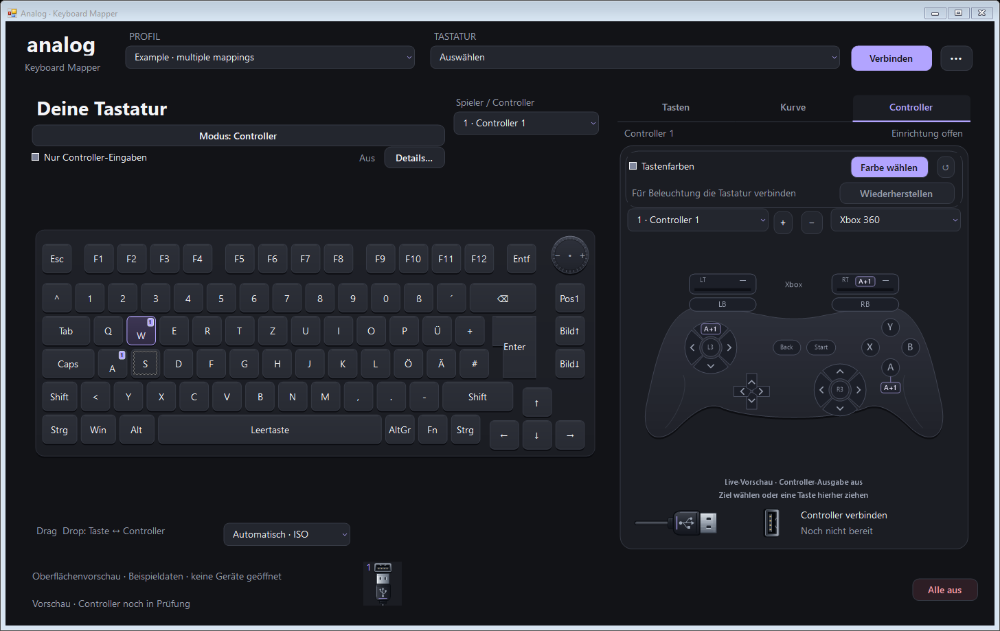
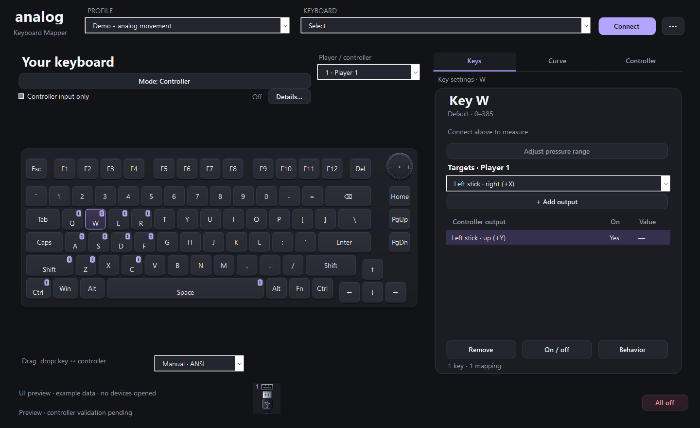
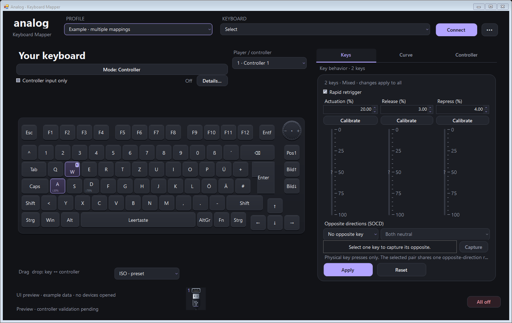
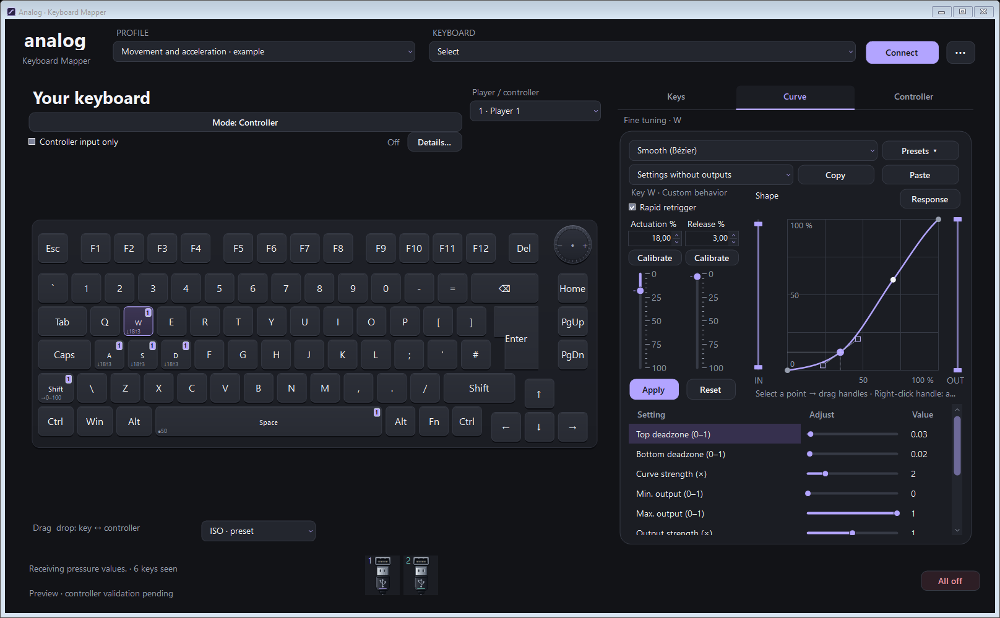
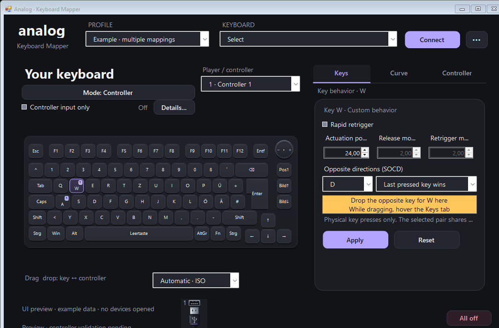

# Analog Key Mapper

**Turn GamaKay TK75 TMR key pressure into controller input — with visual mapping, editable response curves and optional key lighting.**

**Free and open source · 1.0.0-rc.8 · Windows x64**

**[Download Windows rc.8](https://github.com/SirRanjid/analog-key-mapper/releases/download/v1.0.0-rc.8/AnalogKeyMapper-1.0.0-rc.8-windows-x64.zip)** · [Release notes and source ZIP](https://github.com/SirRanjid/analog-key-mapper/releases/tag/v1.0.0-rc.8) · [User guide](docs/user-guide.md) · [Build from source](docs/building.md#compile-from-source)

## Make each key work your way

- **Map in both directions.** Drag a key onto a controller output, or an output onto a key. The grabbed shape follows your pointer; readable left/right labels and numbered key badges identify assignments.
- **Keep controller setups separate.** Mix Xbox 360 and DualSense slots, each with its own mappings, color and USB connection control. Pending connections stay visible and can be cancelled.
- **See and tune each output.** Keys, Curve and Controller tabs keep the keyboard in place. A larger square graph, compact settings and directly editable Bézier handles let you refine any curve, including presets.
- **Set key behavior together.** Configure Rapid Trigger and opposite-key handling (SOCD). Use Capture, then click the opposite key to pair it. Use Ctrl+click or a selection rectangle for bulk edits, with undo.
- **Tune one key or a whole selection.** Set individual min/max pressure ranges, or calibrate selected keys with one press and release. The keyboard shares one adjustable scale. Two vertical controls set actuation and release; move away from a slider while dragging for finer adjustments.
- **Save your setup and lighting.** Keep JSON profiles, signal presets and named controllers. Optional mapped-key colors include a backup and restore workflow. English and German are included.
- **Keep the editor out of the way.** Use the tray or opt into Windows startup. Controller reconnection is a separate option that starts off. [Background startup guide](docs/background-startup.md).

## Quick start

1. [Download the Windows rc.8 ZIP](https://github.com/SirRanjid/analog-key-mapper/releases/download/v1.0.0-rc.8/AnalogKeyMapper-1.0.0-rc.8-windows-x64.zip) and extract it into a writable folder.
2. Double-click **`Verify-Checksums.bat`** to check the included files.
3. Open **`AnalogKeyMapper.exe`** inside the extracted `AnalogKeyMapper` folder, connect your keyboard by USB, and create a mapping.

The editor needs Windows x64 and .NET Framework 4.x; no installer or compiler is required for this download. The Xbox/DualSense helper is included, but actual virtual-controller output also needs the separate compatible USB/IP driver. Follow [the output setup instructions](docs/building.md#virtual-controller-output).

This is an **unsigned release candidate**, not stable 1.0. Windows application control may block the app or a helper. Checksums verify file integrity; they are not a code signature. If Windows blocks a file, stop that attempt and keep the error. Do not disable protections to run it.

Prefer to compile it yourself? Download the separate **source ZIP**, verify its checksums, and run **`Build.bat`**. The source package includes the controller-helper source and its vendored dependencies; Go is needed only when building that helper. See [build instructions](docs/building.md).

## Release candidate

**rc.8** gives the curve more room beside two vertical controls and keeps the settings below compact. **Actuation** also determines Rapid Trigger's renewed press; **Release** sets the release movement. Both have a calibration button. Every built-in preset curve can be refined with Bézier points and handles without changing the saved preset. Sliders share finer dragging away from their track. The graph has no hover popups; other setting hints are brief and delayed. Scrollbar painting also covers native visibility and handle changes. See the [user guide](docs/user-guide.md).

The release candidate also includes these connection and lifecycle safeguards:

- Controller creation runs asynchronously. Cancelled or outdated requests cannot later activate a controller after its profile, input source or mode has changed.
- Windows shutdown starts controller cleanup, profile saving and lighting restoration independently. The keyboard helper also restores the original lighting before releasing its connection; unfinished recovery retains its backup.
- Optional startup reconnection consumes the previous confirmed session once. A failed save or interrupted exit does not silently reuse an old controller list; the app explains when manual connection is needed.
- Compact lighting journal names support normal extracted download folders while preserving recovery from older backups.

Profiles support **up to 32 controller slots**, subject to Windows' limit of **four XInput controllers system-wide**, including physical devices. DualSense uses a separate HID path and covers common mapped controls.

The earlier hardware test covered **two Xbox plus two DualSense devices** and wired TK75 TMR model 3591 input. It does not validate the current release candidate or 32 connected devices. Final hardware and game acceptance remains open. [Compatibility and test status](docs/status.md) · [Hardware record](docs/multi-controller-acceptance.md) · [Synthetic performance measurements](docs/performance.md).

Key settings, calibration and response curves

Individual pressure ranges and output assignments:

Actuation and Rapid Trigger controls, each with its own Calibrate button:

Response settings with sliders and a square curve editor:

Capture an opposite key directly on the keyboard:

Screenshots use synthetic example data. The interface is shown in English; key legends follow the selected physical keyboard layout.

## Contributing and license

Bug reports, reproducible tests and focused improvements are welcome. See [Contributing](CONTRIBUTING.md).

The application is free to use. The original mapper code is available under the [MIT License](LICENSE). The VIIPER-derived output helper and other third-party components retain their own licenses; see [the helper notice](src/ViiperOutputHost/NOTICE.md) and [cursor license](src/App/Assets/Cursors/LICENSE).

Created with assistance from ChatGPT and refined through testing and user feedback.
