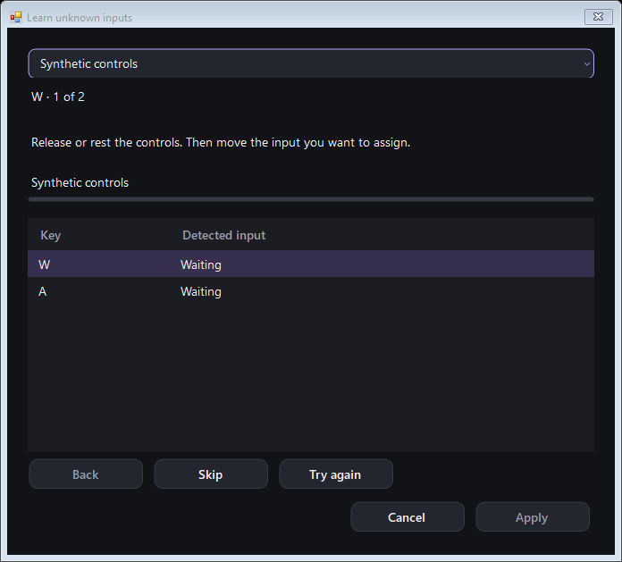
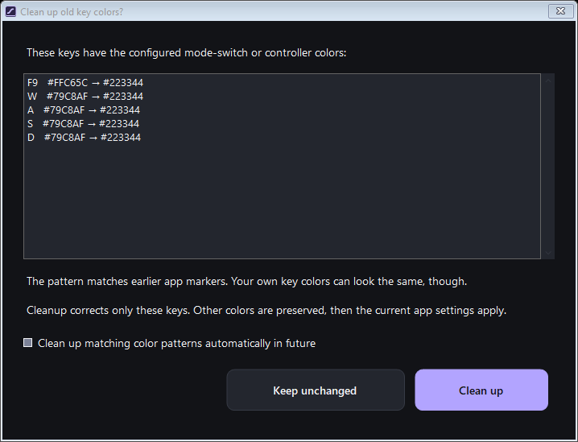
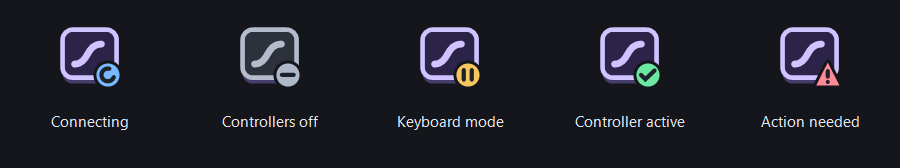

# Analog Key Mapper

**Turn keyboard pressure and supported hardware inputs into controller controls — with visual mapping, editable response curves and optional key lighting.**

**Free and open source · 1.0.0-rc.11 · Windows x64**

**[Download Windows rc.11](https://github.com/SirRanjid/analog-key-mapper/releases/download/v1.0.0-rc.11/AnalogKeyMapper-1.0.0-rc.11-windows-x64.zip)** · [Release notes and source ZIP](https://github.com/SirRanjid/analog-key-mapper/releases/tag/v1.0.0-rc.11) · [User guide](docs/user-guide.md) · [Build from source](docs/building.md#compile-from-source)

## Make each key work your way

- **Map in both directions.** Drag a key onto a controller output, or an output onto a key. The grabbed shape follows your pointer; readable left/right labels and numbered key badges identify assignments.
- **Learn missing inputs together.** Select unresolved keys, right-click and choose **Learn unknown inputs…**. Pick the source device, then press or move each input in turn. Standard keyboard keys are identified automatically; supported buttons, axes, hats and relative controls can fill the remaining gaps. [Input learning guide](docs/input-learning.md).
- **Keep controller setups separate.** Mix Xbox 360 and DualSense slots, each with its own mappings, color and USB connection control. Pending connections stay visible and can be cancelled.
- **Keep your place while editing.** Clicking another key updates the settings in the tab you are using. Each tab also retains its scroll position when you return to it.
- **See and tune each output.** Keys, Curve and Controller tabs keep the keyboard in place. A larger square graph, compact settings and directly editable Bézier handles let you refine any curve, including presets.
- **Set key behavior together.** Configure Rapid Trigger and opposite-key handling (SOCD). Use Capture, then click the opposite key to pair it. Use Ctrl+click or a selection rectangle for bulk edits, with undo.
- **Tune one key or a whole selection.** Set individual min/max pressure ranges, or calibrate selected keys with one press and release. The keyboard shares one adjustable scale. Two vertical controls set actuation and release; move away from a slider while dragging for finer adjustments.
- **Save your setup and lighting.** Keep JSON profiles, signal presets and named controllers. Optional mapped-key colors include backups, restoration and a startup check for leftover key markers, with confirmation before cleanup. English and German are included.
- **Read the status at a glance.** The app logo carries a compact tray badge for connection, keyboard mode, active controllers or an action needing attention. Use the tray or opt into Windows startup; controller reconnection starts off separately. [Background startup guide](docs/background-startup.md).

## Quick start

1. [Download the Windows rc.11 ZIP](https://github.com/SirRanjid/analog-key-mapper/releases/download/v1.0.0-rc.11/AnalogKeyMapper-1.0.0-rc.11-windows-x64.zip) and extract it into a writable folder.
2. Double-click **`Verify-Checksums.bat`** to check the included files.
3. Open **`AnalogKeyMapper.exe`** inside the extracted `AnalogKeyMapper` folder, connect your keyboard by USB, and create a mapping.

The editor needs Windows x64 and .NET Framework 4.x; no installer or compiler is required for this download. The Xbox/DualSense helper is included, but actual virtual-controller output also needs the separate compatible USB/IP driver. Follow [the output setup instructions](docs/building.md#virtual-controller-output).

This is an **unsigned release candidate**, not stable 1.0. Windows application control may block the app or a helper. Checksums verify file integrity; they are not a code signature. If Windows blocks a file, stop that attempt and keep the error. Do not disable protections to run it.

Prefer to compile it yourself? Download the separate **source ZIP**, verify its checksums, and run **`Build.bat`**. The source package includes the controller-helper source and its vendored dependencies; Go is needed only when building that helper. See [build instructions](docs/building.md).

## Release candidate

**rc.11** keeps your current tab and scroll position when you select another key. Settings, mapping rows and choices update in place, and returning to a tab keeps the position you left. Scrollbars also keep their themed appearance during hover, thumb dragging and held arrow/page clicks, including tables and open drop-downs. [What's new](docs/release-notes-1.0.0-rc.11.md).

Startup lighting review and the cleanup improvements from rc.10 remain included. Matching leftover key colors require confirmation before cleanup unless you have explicitly saved permission for future matching patterns. Exit and Windows shutdown wait for actual keyboard-helper cleanup. [Lighting guide](docs/user-guide.md#optional-keyboard-lighting) · [Background startup](docs/background-startup.md).

The combined update passed **16,993 local UI checks**, including **230 key-selection checks** and **2,373 scrollbar checks**. The workflow covers **62 offline suites**, Windows builds, controller-helper checks and verified packaging; see [validation status](docs/status.md) for recorded results and their exact scope, and the [release page](https://github.com/SirRanjid/analog-key-mapper/releases/tag/v1.0.0-rc.11) for the completed workflow behind its downloads. Physical hardware, real Windows shutdown and game acceptance of rc.11 remain open.

The rc.9 input-learning features remain: automatically identify standard keyboard positions, learn supported HID controls, review assignments and apply them together with one undo. Routes reconnect only to their saved device identity. Analog pressure still needs a supported protocol; standard keyboard on/off events cannot supply pressure values. [Input learning guide](docs/input-learning.md).

The rc.8 curve improvements remain: a larger square graph beside actuation/release controls, compact settings, editable Bézier presets, and finer slider adjustment when dragging away from the track. See the [user guide](docs/user-guide.md).

The release candidate also includes these connection and lifecycle safeguards:

- Controller creation runs asynchronously. Cancelled or outdated requests cannot later activate a controller after its profile, input source or mode has changed.
- Windows shutdown starts controller cleanup, profile saving and lighting restoration independently, and waits for completed helper cleanup within its total time budget. The helper retains the approved baseline for restoration; unfinished recovery retains its backup.
- Optional startup reconnection consumes the previous confirmed session once. A failed save or interrupted exit does not silently reuse an old controller list; the app explains when manual connection is needed.
- Compact lighting journal names support normal extracted download folders while preserving recovery from older backups.

Profiles support **up to 32 controller slots**, subject to Windows' limit of **four XInput controllers system-wide**, including physical devices. DualSense uses a separate HID path and covers common mapped controls.

The earlier hardware test covered **two Xbox plus two DualSense devices** and wired TK75 TMR model 3591 input. It does not validate the current release candidate or 32 connected devices. Final hardware and game acceptance remains open. [Compatibility and test status](docs/status.md) · [Hardware record](docs/multi-controller-acceptance.md) · [Synthetic performance measurements](docs/performance.md).

Key settings, calibration and response curves

Individual pressure ranges and output assignments:

Actuation and Rapid Trigger controls, each with its own Calibrate button:

Editable preset shapes with Bézier points, range handles and compact settings:

Capture an opposite key directly on the keyboard:

Learn missing inputs

Select unresolved keys, choose the input device and work through the selection. Review all assignments before applying them together.

[Input learning guide](docs/input-learning.md)

Startup lighting check and tray status

Review detected key colors and their proposed replacements before cleanup:

The app logo stays recognizable while a small badge shows the current status:

Screenshots show **1.0.0-rc.11** with synthetic example data, the English interface and QWERTY key legends. The tray-status image compares the app's rendered icon states.

## Contributing and license

Bug reports, reproducible tests and focused improvements are welcome. See [Contributing](CONTRIBUTING.md).

The application is free to use. The original mapper code is available under the [MIT License](LICENSE). The VIIPER-derived output helper and other third-party components retain their own licenses; see [the helper notice](src/ViiperOutputHost/NOTICE.md) and [cursor license](src/App/Assets/Cursors/LICENSE).

Created with assistance from ChatGPT and refined through testing and user feedback.
