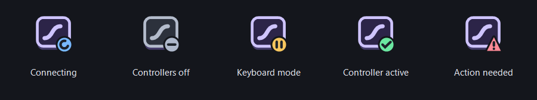

# Background startup and tray controls

**Current source · controller connections updated 5 October 2026.** The controller connection changes below are unreleased and are not included in the published rc.11 download. [Controller update and validation](controller-connections-2026-10-05.md) · [Release validation status](status.md).

## Open or hide the window

Opening `AnalogKeyMapper.exe` normally shows the editor. Opening the same installation again restores its existing window, including when it is hidden in the tray; it does not start another mapper instance in the same Windows session.

`AnalogKeyMapper.exe --background` starts the same WinForms application in the notification area without showing the editor or a taskbar window. A second background launch leaves the existing window as it is. Click the tray icon, or choose **Open Analog Key Mapper** from its menu, to show the editor.

Enable **Minimize to tray** in the application menu to make the window's **X** hide the editor while keeping input and connected controllers running. Clicking the option changes the saved checkbox without immediately hiding the window. Closing to the tray saves the profile first. The option initially starts off; when disabled, **X** exits the app.

## Read the tray status

The tray uses the official Analog Key Mapper logo with a compact badge. Hover over it to read the specific status; click it to open the editor.

| Badge | Meaning |
| --- | --- |
| Blue arc | The input connection is starting. |
| Gray minus | Controllers are off, or there is no input connection; the tooltip distinguishes these states. |
| Amber pause | Keyboard mode. Connected controllers remain neutral. |
| Green check | A controller is active in controller mode. |
| Red warning triangle | Action is needed, such as a lighting confirmation or an error. Open the app for details. |

The badge reports app state. A green check does not establish that a game has accepted the virtual controller.

## Start with Windows

**Start with Windows · in tray** is an opt-in setting in the application and tray menus. Enabling it registers this executable with `--background` for your Windows sign-in. Disabling it removes this installation's matching entry. Keep the application at the registered location, or enable the option again after moving it.

The setting uses the current user's `HKCU\Software\Microsoft\Windows\CurrentVersion\Run` entry named `AnalogKeyMapper`. Opening the application or its menu does not enable or repair startup automatically. It does not add a Windows service or register startup for other users.

## Automatic controller connections

**Connect controllers automatically** is separate from Windows startup. It defaults to **on** when no preference has been saved; an existing saved off preference remains off. Change it in the application or tray menu. Importing a mapping profile does not change this application preference.

With the option enabled, controller slots with enabled mappings connect once the current profile's input connection is reading. Event-driven keyboards need not report a first key press: never-observed keys remain unavailable and output starts neutral. Empty slots do not create unused devices. Connections run asynchronously, one at a time; failed attempts wait 2, 4, 8, 16 and then 30 seconds between retries. A lost connection also waits before retrying. Existing backend availability checks and controller limits still apply. A failed slot does not prevent other eligible slots from being considered.

The last saved local startup profile is restored when it still exists. `data/controller-startup.json` stores the application preference and profile filename; the separate session journal remains available for shutdown diagnostics. An interrupted prior exit no longer blocks automatic connection: eligible slots are resolved from the currently loaded profile. If startup state cannot be saved and verified, automatic connection pauses for that session and a menu notice explains the problem.

Changes to mappings, curves, calibration and matching profiles keep a controller's existing connection when its ID and controller type still match. Output is neutralized while the new settings are applied, and held keys must be released before they become active again. Removing a slot disconnects it; changing its controller type requires a new connection. A pending connection uses the latest accepted settings when it completes. An unfinished edit postpones automatic connection without discarding the user's draft or connection request.

Manually disconnecting a controller keeps that slot off for the current session until it is manually connected again. **Turn all controllers off**, including its shortcut, stops automatic connection for the session; settings changes do not undo that decision. Input learning and sleep pause automatic connection; it can resume afterward when input is ready. Input or output loss still neutralizes and disconnects the affected output, and the automatic policy retries eligible slots once conditions allow. Keys held while a controller connects require release before they can produce mapped output.

## Confirm leftover key colors

The first lighting check after startup or keyboard reconnection also runs when the editor is hidden. It looks for the configured mode-switch and controller colors on their configured keys, independently of enabled lighting options, mappings and controller connections. The same color on an unrelated key prevents that color from being treated as a leftover marker.

When matching markers have known replacement colors, a **Clean up old key colors?** window shows the proposed changes. **Clean up** approves them once. **Keep unchanged**, closing the question or exiting grants no permission; lighting changes pause until the keyboard reconnects. Input and controller handling continue while the question is open.

Future automatic cleanup starts **off**. The question offers **Clean up matching color patterns automatically in future**; this permission can be revoked in either menu with **Automatically clean recognized key colors at startup**. It is saved separately from mapping profiles, Windows startup and controller reconnection. Importing a profile cannot enable it.

Only detected markers are corrected, and other colors are preserved. A compatible backup or a uniform current background must establish their replacement colors; otherwise the app leaves lighting unchanged even with automatic cleanup enabled. An identical external pattern cannot be distinguished from earlier app markers, so matching colors are not proof of their origin. See the [lighting guide](user-guide.md#startup-check-for-leftover-colors) for the full checks and recovery behavior.

## Exit and background work

Tray **Exit** always closes the app, even when **Minimize to tray** is enabled. The window's **X** also exits when that option is off. A real exit saves the profile, neutralizes and disconnects controllers, and restores the lighting baseline. Normally that is the lighting read at startup; after approved startup cleanup, it is the corrected state. A small status window reports these phases and final helper cleanup. Its progress advances when work completes. The keyboard helper retains the same baseline and attempts restoration before releasing the keyboard if the app connection is interrupted. The backup remains available if the keyboard becomes unavailable.

Windows shutdown or sign-out performs a real exit without a save question once Windows commits to ending the session. The app promptly accepts the initial query and registers a short cleanup reason with Windows. The final session response waits up to **25 seconds** while controller cleanup, lighting restoration and profile saving run independently. The app waits for the actual keyboard-reader and helper cleanup to finish and includes controller removals already in progress. The keyboard helper requests the documented later shutdown order so it remains available while the editor restores lighting. Windows can show the registered reason if cleanup takes longer. An unanswered startup lighting question is dismissed without permission and does not block cleanup. If the initial shutdown query is canceled, the app stays usable. Forced termination, power loss or an unplugged keyboard can prevent cleanup; recovery records remain available. An unconfirmed previous shutdown no longer blocks the automatic controller policy described above.

Hidden or minimized windows skip live UI refresh and preview calculations. Input safety checks, shortcuts, device handling and lighting maintenance remain active. The maintenance timer remains configured for **33 ms**, and active controller output retains its **4 ms** worker wait. These are scheduling settings, not measured end-to-end latency or a guarantee of zero latency, constant CPU usage or identical performance on every machine.

Disconnected slots without a visible preview sleep until a setting, preview request, connection or shutdown wakes them. They do not repeatedly copy keyboard input or calculate unused frames.

Windows still decides whether the unsigned app and its helpers may run. Starting in the background does not alter that decision. Startup-color and shutdown behavior has synthetic test coverage; physical shutdown and game acceptance remain open. The controller update also has a recorded local startup check, with its scope described in the [controller connection report](controller-connections-2026-10-05.md). See [release validation](status.md) for the published release's results.
