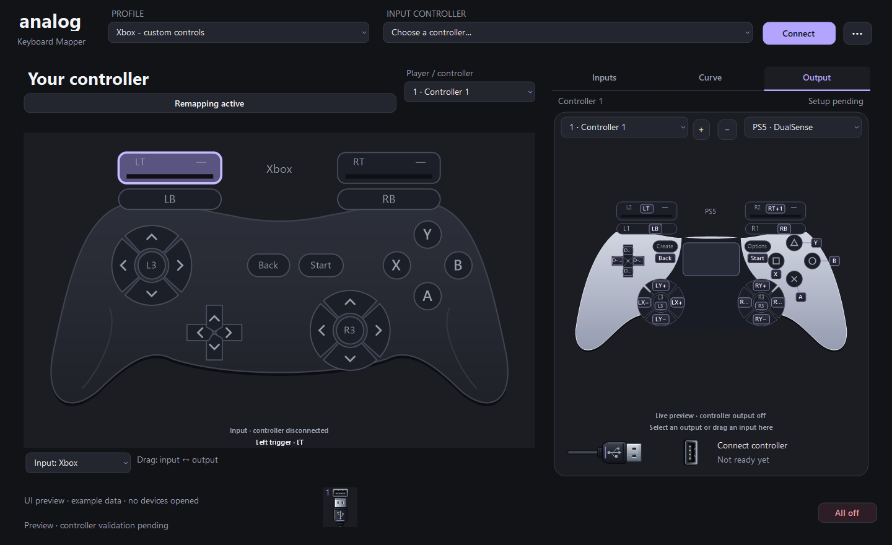
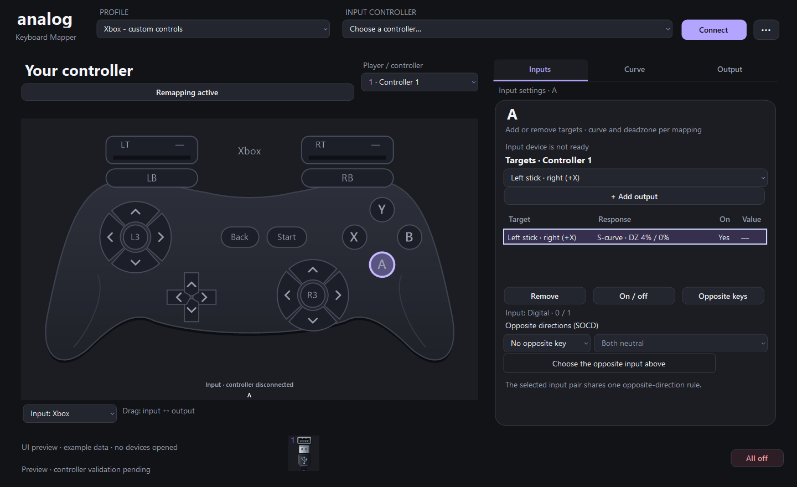
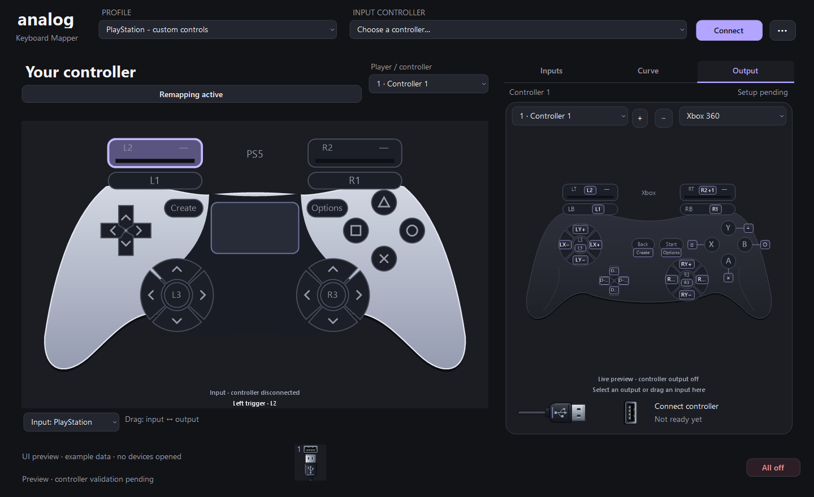

# Remap a physical controller

[Back to the project](../README.md) · [User guide](user-guide.md) · [Virtual output setup](building.md#virtual-controller-output)

The **6 October 2026 source update** adds Xbox and PlayStation input modes. The left side becomes an interactive controller, while the existing mapping and response editors remain on the right. This feature is in the source checkout; the published **rc.11** download does not include it.

## Choose the input

1. Use **Input: Keyboard / Xbox / PlayStation** below the left-hand picture. The first switch creates a separate profile with the common controls mapped to their corresponding outputs. Switching back restores the previous source profile and its mappings.
2. Connect your physical controller, open the device list at the top, and select it. Choose **Connect** to read its input. The picture displays received buttons, stick directions and trigger values.
3. Click the control you want to change. **Ctrl+click** adds or removes controls from the selection. Use **Inputs** to add, remove or disable outputs, or drag between the input picture and the virtual output picture in either direction.
4. Choose **Player / controller** for the output slot. Its **Xbox 360 / PS5 · DualSense** selector is independent of the physical input: an Xbox input can map to DualSense output, and a PlayStation input can map to Xbox output.
5. Install the existing [virtual output dependencies](building.md#virtual-controller-output) if needed. Automatic connection follows the configured preference when the input is ready; the illustrated USB connectors and **All off** retain their existing behavior.

The top **Connect** button connects the physical input. The USB connectors operate the virtual outputs. Selecting an output type does not change the controller being read.



## Remap and tune

The common control set has **24 selectable regions**: four directions for each stick, two analog triggers, four face buttons, two shoulder buttons, two menu buttons, two stick clicks and four D-pad directions. Each can feed any supported virtual output. A trigger can become a button, a button can drive a trigger, and several inputs or outputs can be combined using the existing mapping rules.

Initial profiles use matching one-to-one mappings. Remove an existing mapping before adding its replacement if the original action should stop; adding a target deliberately keeps other assignments. Removing every mapping disables that input's virtual actions. Repeating an existing input/output/slot assignment adds no duplicate. **Undo/Redo** also applies to controller mappings.

For example, swap a stick's X and Y axes by replacing its right/left assignments with up/down, and its up/down assignments with right/left. Map the opposite direction to invert an axis. Each half-axis is independent, so you can send its positive and negative movement to different triggers, buttons or controller slots. A trigger can likewise drive either stick direction. A physical button supplies exactly **0 when released and 1 when pressed**; map two buttons to opposite directions for digital stick control. The default linear, unfiltered assignment preserves those endpoints. Optional smoothing and output-range settings can deliberately change the resulting output.

**Curve** provides the existing deadzones, response curves, output ranges and filtering for selected assignments. Input values use their declared controller range; keyboard pressure calibration and keyboard input suppression do not apply to this mode. The **Remapping active / Remapping paused** button pauses or resumes mapped output while leaving the virtual connection in place.

This example replaces the Xbox **A** button's normal action with **Left stick · right (+X)** and applies an S-curve to that assignment:





## Supported inputs and boundaries

- **Xbox:** physical controllers exposing the supported Windows XUSB 1.1 interface, commonly through USB or a compatible wireless adapter. The reader uses receiver-local index 0; legacy XUSB 1.0 and additional Xbox 360 pads sharing one receiver are not supported. A controller exposed only through a Bluetooth HID interface is not handled by this Xbox reader. If a device is absent from the list, its connection or protocol may not be supported.
- **PlayStation:** supported Sony DualShock 4, DualSense and DualSense Edge HID reports, including the implemented USB and Bluetooth formats. Unrecognized devices and report formats are rejected. The left-hand PlayStation picture uses the existing DualSense-style illustration for this family.
- **Controls:** common buttons, sticks and triggers. Guide/PS, touchpad, motion sensors, audio, vibration and adaptive-trigger effects are outside this mapping surface.
- **Device selection:** a profile remembers the selected device identity. It does not silently switch to another player's controller. A changed Windows device path can require selecting the controller again. Recognized virtual-device ancestry is rejected to prevent this application's output from being read back as its input.
- **Games:** the physical controller remains visible to Windows. This feature does not hide it, so a game may see both the physical and virtual controllers. Game compatibility and full hardware acceptance remain to be checked. Xbox output also shares Windows' four-XInput-controller limit with physical Xbox devices.

Missing or disconnected input becomes unavailable instead of retaining its last movement. Existing output lifecycle safeguards and release-before-rearming behavior remain in use when profiles or routes change. An editor preview is not proof that a game accepts the virtual device.

## Validation and screenshots

The source includes synthetic controller-report, profile and UI checks. Run `tests/Test-GamepadUi.ps1` to exercise the real editor in passive preview mode, including both input families, all selectable control regions, drag-and-drop in both directions, mapping edits, undo/redo, independent output styles, profile restoration and minimum-size layout. It also checks that keyboard calibration is preserved across source switches and that keyboard-only controls are hidden in controller mode. It opens no physical input, virtual output or global hotkey.

The local runs on **6 October 2026** passed **4,836 profile checks**, **175 routing checks**, **237 backend checks**, **80 source-lifecycle checks**, and **355 controller UI checks**, including the passive checks used when exporting all three screenshots. The publication checkout also passed its complete **16,920-check application UI suite**. These are synthetic checks, not physical-device or game acceptance.

The images above show the real English application UI with synthetic example profiles and disconnected devices. They illustrate the new source update, not the rc.11 binary or a completed physical-controller acceptance test. To regenerate them, run:

```powershell
.\tests\Test-GamepadUi.ps1 -ScreenshotDirectory .\docs\images
```
